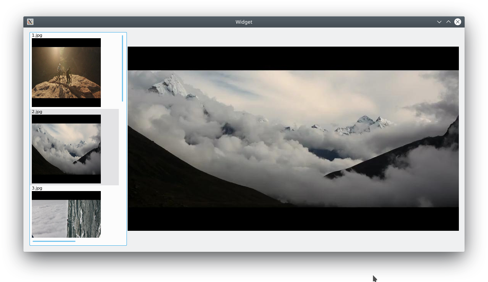

# ImageViewer

This is a Qt ListView example to show the images in your directory.

## Description

1. You need to set the directory path in "widget.cpp"

```
QDir dir ("/Path/to/your/directory");
```

2. The application will shows like the following screenshot.


